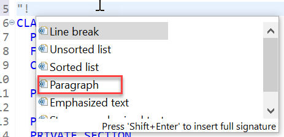
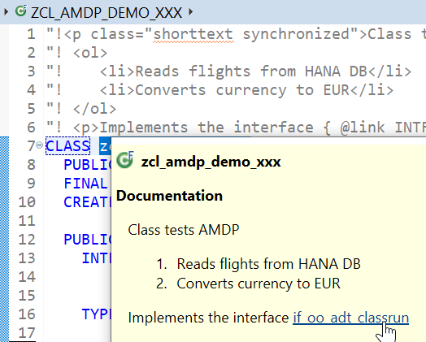
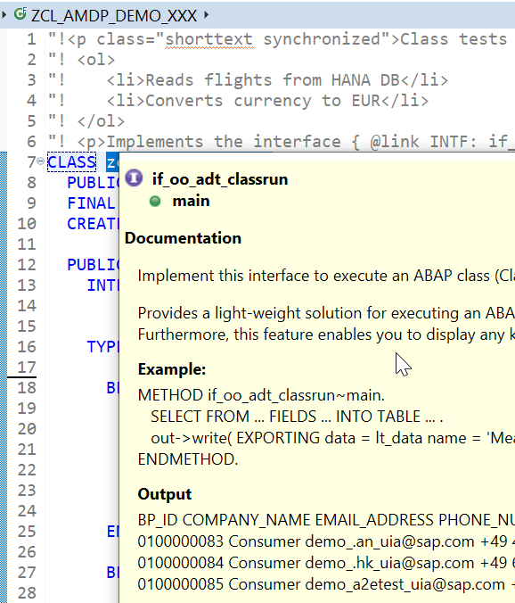

## Prerequisites
- You have an entitlement to SAP Cloud Platform, ABsdAP Enviroasnment. For more information, see **Tutorial**: [Create Your First ABAP Console Application](abap-environment-console-application), steps 1-2
- You have installed [ABAP Development Tools](https://tools.hana.ondemand.com/#abap), latest version
- **Tutorial**: [Create an AMDP and Analyze Its Performance](abap-environment-amdp-profiling)

## Details
### You will learn  
- How to maintain ABAPDoc comments
- How to synchronize comments so they appear in the Outline View
- How to add an sorted list
- How to create a link to other development object documentation within ADT

ABAPDoc comments are used to document your code. This makes it more readable. If other developers use one of your development objects, they can find out more about it by selecting the object name in the code and choosing **Element Info ( `F2` )**.

All ABAPDoc comments begin with **`"!`**.

Always replace `XXX` with your initials or group number.

---

[ACCORDION-BEGIN [Step 1: ](Open ABAP class)]
First, open the ABAP class **`ZCL_AMDP_DEMO_XXX`** from the tutorial [Create an AMDP and Analyze Its Performance](abap-environment-amdp-profiling)

!

[Click to download xls] (10n.xls)

[Click to download mpeg] (11n.mpeg)

[Click to download zip] (12n.zip)

[Click to download doc] (1n.doc)

[Click to download docx] (2n.docx)

[Click to download pdf] (3n.pdf)

[Click to download txt] (4n.txt)

[Click to download mp4] (5n.mp4)

[Click to download csv] (6n.csv)

[Click to download sql] (JOINSn.sql)

[Click to download mp3] (Jinglebellsringtonen.mp3)

[Click to download xlsx] (Book1.xlsx)


[DONE]
[ACCORDION-END]

[Click to download jpg] (8.jpg)

[Click to download svg] (9.svg)

[Click to download xml] (template.xml)

[Click to download gif] (CWF.gif)

[Click to download png] (access40.png)

[Click to download json] (resp.json)

[Click to download ico] (monitoriconn.ico)

[Click to download mp3 crashed] (gfgg.mp3)

[ACCORDION-BEGIN [Step 2: ](Create ABAPDoc comment)]
1. Immediately before the class definition, add an ABAPDoc comment to the class by entering **`"!`** and choosing **Auto-complete ( `Ctrl+Space` )**.

2. From the dropdown list, choose **Paragraph**, then add the following comment:

    **`"!<p>Class tests AMDP</p>`**

    !

    >You must insert the ABAPDoc comment **immediately** before the declaration; otherwise you will get a warning from ADT.

3. Add the following to the paragraph ( `<p>` ) tag: **`class="shorttext synchronized"`**, so your code looks like this:

    ```
    "!<p class="shorttext synchronized">Class tests AMDP: </p>
    ```

4. Add the following comments to the table type **`ty_result_line`** and to the method **`GET_FLIGHTS`** respectively:

    ```
    "!<p class="shorttext synchronized">Table type of Flights from HANA DB</p>
    "! <p class="shorttext synchronized"> Method reads flights from HANA DB using AMDP</p>
    ```

5. Save and activate your class.

The comments should now appear in the Outline View:

!

[DONE]
[ACCORDION-END]


[ACCORDION-BEGIN [Step 3: ](Add sorted list)]
1. Choose **Enter**. The system automatically inserts the ABAPDoc comments annotation `"!"` for you.

2. Again, choose **Auto-complete ( `Ctrl+Space` )**. Then choose **Sorted list**.

    !

3. Add the following two statements, so that your code looks like this:

    ```
    "! <ol>
    "!    <li>Reads flights from HANA DB</li>
    "!    <li>Converts currency to EUR</li>
    "! </ol>

    ```

[DONE]
[ACCORDION-END]

[ACCORDION-BEGIN [Step 5: ](Add link)]
1. Immediately after the sorted list, choose **Enter**.

2. Now enter the following comment:

    **`"! <p>Implements the interface { @link INTF: if_oo_adt_classrun } </p>`**

This creates a link to the Element information for that interface.

[DONE]
[ACCORDION-END]

[ACCORDION-BEGIN [Step 6: ](Check comment)]
1. Save and activate your class ( **`Ctrl+S, Ctrl+F3`** ).

2. Select your class and choose **Show code element information (`F2`)**.

3. Your comments should appear look like this:

    !

4. If you choose the link to the interface, its documentation appears:

    !

[DONE]
[ACCORDION-END]

[ACCORDION-BEGIN [Step 5: ](Test yourself)]


[VALIDATE_1]
[ACCORDION-END]

### More Information
- SAP Help Portal: [Editing ABAP Doc Comments](https://help.sap.com/viewer/5371047f1273405bb46725a417f95433/Cloud/en-US/4ec136586e391014adc9fffe4e204223.html)
- SAP Keyword Documentation: [ABAPDoc](https://help.sap.com/doc/abapdocu_cp_index_htm/CLOUD/en-US/index.htm?file=abendoccomment.htm)

---
